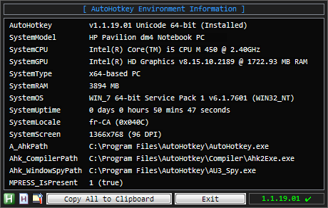
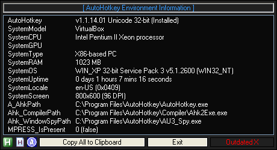
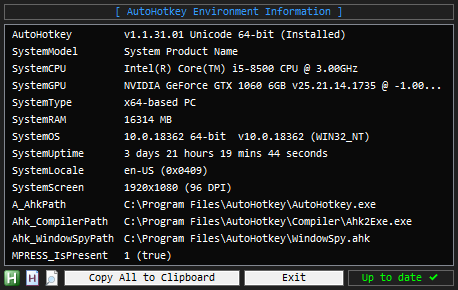
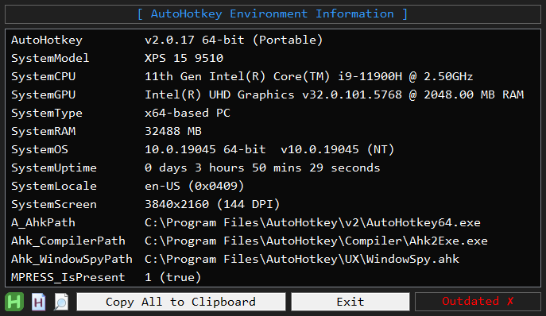

AEI.ahk
==============================

Displays AutoHotkey Environment Information and AHK support relevant System Information with a fancy update checker that auto-downloads with a progress bar.  

- For AHK v1.1: https://www.autohotkey.com/boards/viewtopic.php?f=6&t=5825  
- For AHK v2.0: https://www.autohotkey.com/boards/viewtopic.php?f=83&t=133706  
  
By joedf, Released under the [MIT License](http://opensource.org/licenses/MIT)  

### Screenshots

