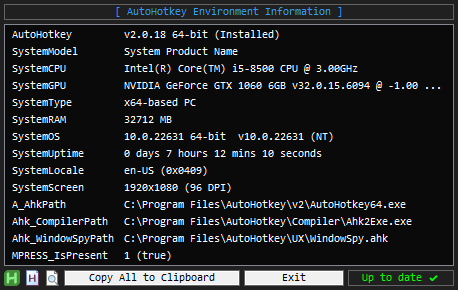

AEI.ahk
==============================

Displays AutoHotkey Environment Information and AHK support relevant System Information with a fancy update checker that auto-downloads with a progress bar.  
http://ahkscript.org/boards/viewtopic.php?f=6&t=5825  
  
By joedf, Released under the [MIT License](http://opensource.org/licenses/MIT)  

### Screenshots

